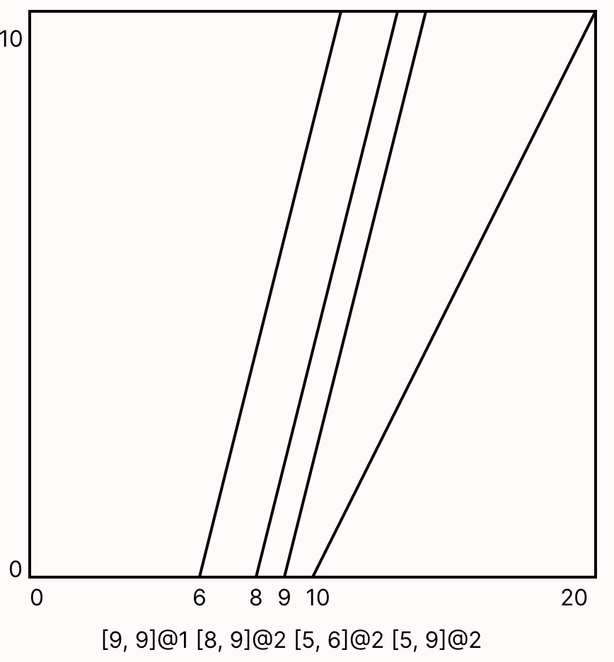

# drone-deconfliction

A repository storing Forge Models (and their viz's) for unmaned aircraft systems flight deconfliction.
Based on [this](https://www-old.cs.utah.edu/docs/techreports/2020/pdf/UUCS-20-010.pdf) paper.

Example: safe takeoff times for 4 UAVs in one lane.

Legend: `[earliest safe takeoff, latest safe takeoff] @ SPEED`

